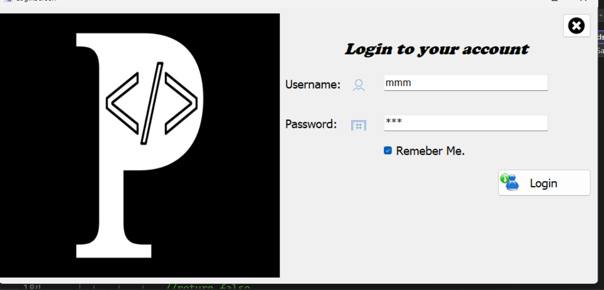
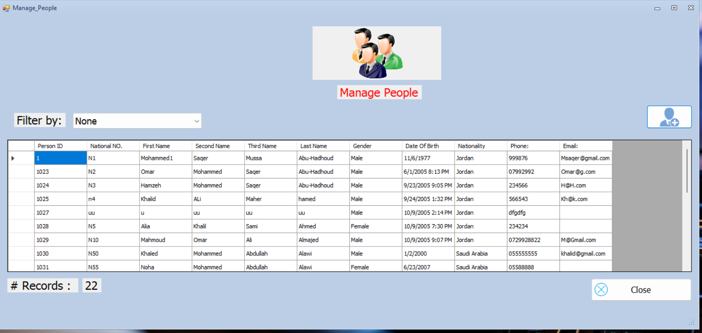
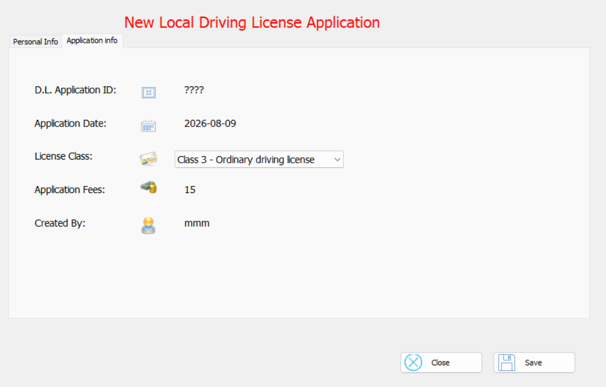

# DVLD

> Driving & Vehicle License Department

## Overview

**DVLD (Driving & Vehicle License Department)** is a desktop application developed using **C# and Windows Forms** to manage the main operations of a driving and vehicle licensing department.

The system manages people, users, driving license applications, drivers, driving licenses, tests, test appointments, international driving licenses, and detained licenses.

The application was developed as part of the **ProgrammingAdvices Course 19 project** and follows a **three-layer architecture** that separates the presentation layer, business logic, and data access.

The project uses **SQL Server** as its database and communicates with the database through a dedicated Data Access Layer.

The main application provides a centralized interface through which authorized users can manage the different services provided by the department.

---

## Features

### 👤 People Management

The system provides functionality for managing people registered in the department.

* Search for people.
* View person information.
* Add new people.
* Update existing people.
* Delete people.
* Prevent duplicate people using the national number.
* Store personal information including:

  * National number
  * Full name
  * Date of birth
  * Address
  * Phone number
  * Email
  * Nationality
  * Personal image

---

### 🔐 User Management

The system provides user and authentication management.

* User login.
* Add new users.
* View user information.
* Update user information.
* Delete users.
* Change user password.
* Activate/deactivate users.
* Search for users.
* Associate system users with people.
* Maintain the currently logged-in user.

---

### 📝 Application Management

The system manages different types of applications and their lifecycle.

* View applications.
* Search applications.
* Create new applications.
* Update application information.
* Manage application types.
* Manage application fees.
* Track application status.
* Create local driving license applications.
* Renew driving licenses.
* Replace lost licenses.
* Replace damaged licenses.
* Create retake-test applications.

---

### 🚗 Driving License Management

The application manages the complete driving license lifecycle.

* Issue a driving license for the first time.
* View license information.
* Search for licenses.
* View license history.
* Renew driving licenses.
* Replace lost driving licenses.
* Replace damaged driving licenses.
* Associate licenses with drivers.
* Track license issue and expiration dates.
* Manage license classes.

---

### 🧪 Test Management

The system manages the driving license testing process.

It supports three main test types:

* 👁️ Vision Test
* 📝 Written Test
* 🚘 Street Test

The system provides functionality for:

* Scheduling tests.
* Viewing test appointments.
* Taking tests.
* Recording test results.
* Retaking failed tests.
* Managing test types and their fees.
* Preventing invalid duplicate appointments.

The testing workflow is integrated with local driving license applications.

---

### 🌍 International Driving Licenses

The application supports international driving licenses.

* Create international driving license applications.
* Issue international licenses.
* View international driver information.
* Search international licenses.
* Associate an international license with a driver.
* Associate the international license with the local license used to issue it.
* Track issue and expiration dates.

---

### 🚨 Detained Licenses

The system provides functionality for managing detained driving licenses.

* Detain a driving license.
* Record detention date.
* Record fine fees.
* View detained licenses.
* Release detained licenses.
* Record release date.
* Record the user who performed the release.
* Associate the release with a release application.

---

## System Architecture

The project follows a **three-layer architecture** that separates the user interface, business logic, and database access.

```text
┌──────────────────────────────────────────────┐
│              Presentation Layer              │
│                                              │
│                 My_Project                   │
│                                              │
│             C# Windows Forms                 │
└──────────────────────┬───────────────────────┘
                       │
                       ▼
┌──────────────────────────────────────────────┐
│               Business Layer                 │
│                                              │
│            DVLD_Business_Layer               │
│                                              │
│       Business Rules & Domain Objects        │
└──────────────────────┬───────────────────────┘
                       │
                       ▼
┌──────────────────────────────────────────────┐
│              Data Access Layer               │
│                                              │
│             DVLD_Data_Layer                  │
│                                              │
│        Database Access & SQL Operations      │
└──────────────────────┬───────────────────────┘
                       │
                       ▼
                ┌──────────────┐
                │  SQL Server  │
                │     DVLD     │
                └──────────────┘
```

### 1. Presentation Layer

**Project:** `My_Project`

This is the Windows Forms application responsible for the user interface.

It contains the forms and UserControls used to interact with the system.

The presentation layer is organized into functional modules such as:

* Applications
* People
* Drivers
* Licenses
* Tests
* Users

The UI communicates with the Business Layer instead of directly implementing the application's core business operations.

---

### 2. Business Layer

**Project:** `DVLD_Business_Layer`

The Business Layer contains the application's domain objects and business logic.

Examples include:

```text
clsPerson
clsUser
clsApplication
clsLDLApp
clsDriver
clsLicense
clsTest
clsTestAppointment
clsTestType
clsInternationalLicense
clsDetainedLicense
clsApplicationType
clsLicenseClass
```

This layer is responsible for operations such as:

* Finding records.
* Validating business rules.
* Creating records.
* Updating records.
* Deleting records.
* Controlling application workflows.
* Connecting domain objects with the Data Layer.

For example:

```text
clsApplication
      ▲
      │
      │ inheritance
      │
   clsLDLApp
```

`clsLDLApp` extends the general application object with information specific to local driving license applications.

---

### 3. Data Access Layer

**Project:** `DVLD_Data_Layer`

The Data Layer is responsible for communicating with SQL Server.

Examples include:

```text
clsPeopleDataAccess
clsUsersData
clsApplicationData
clsLicensesData
clsDriversData
clsTestsData
clsTestAppointmentsData
clsTestTypesData
clsInternationalLicensesData
clsDetainedLicensesData
```

The layer uses ADO.NET components such as:

```text
SqlConnection
SqlCommand
SqlDataReader
DataTable
```

The separation means that database operations are kept outside the presentation layer.

---

## Application Workflow

The system contains several business workflows. One of the main workflows is the process of obtaining a driving license for the first time.

### New Driving License Workflow

```text
Person
  │
  ▼
Create Application
  │
  ▼
Select License Class
  │
  ▼
Schedule Vision Test
  │
  ▼
Take Vision Test
  │
  ├──── Failed ────► Retake Test
  │
  ▼ Passed
Schedule Written Test
  │
  ▼
Take Written Test
  │
  ├──── Failed ────► Retake Test
  │
  ▼ Passed
Schedule Street Test
  │
  ▼
Take Street Test
  │
  ├──── Failed ────► Retake Test
  │
  ▼ Passed
Issue Driving License
  │
  ▼
Driver Created / Updated
```

The requirements specify that the applicant must pass the required tests before the driving license can be issued, and that failed tests can be retaken through a new appointment and payment of the required fees.

---

### License Renewal Workflow

```text
Existing License
       │
       ▼
Renew License Application
       │
       ▼
Required Checks
       │
       ▼
Renew License
       │
       ▼
New Expiration Date
```

---

### Lost or Damaged License Replacement

```text
Existing License
       │
       ▼
Replacement Application
       │
       ├──────────────┐
       │              │
       ▼              ▼
 Lost License     Damaged License
       │              │
       └──────┬───────┘
              ▼
       Issue Replacement
```

---

### Test Retake Workflow

```text
Test Appointment
       │
       ▼
Take Test
       │
       ▼
     Failed
       │
       ▼
Create Retake Application
       │
       ▼
Schedule New Appointment
       │
       ▼
Pay Retake/Test Fees
       │
       ▼
Take Test Again
```

The database explicitly supports the relationship between test appointments and retake applications.

---

### International License Workflow

```text
Driver
  │
  ▼
Existing Local License
  │
  ▼
International License Application
  │
  ▼
Issue International License
  │
  ▼
International License
```

The international license record is associated with both the driver and the local license used to issue it.

---

### License Detention Workflow

```text
Active License
      │
      ▼
Detain License
      │
      ├── Detention Date
      ├── Fine Fees
      └── Created By User
      │
      ▼
Detained License
      │
      ▼
Release License
      │
      ├── Release Date
      ├── Released By User
      └── Release Application
```

This allows the system to maintain the complete detention and release lifecycle of a license.

---

## Database Design

The application uses a **SQL Server relational database** named:

```text
DVLD
```

The database schema contains the following main tables.

### 👤 Identity & People

```text
People
Users
Countries
```

### 📝 Applications

```text
Applications
ApplicationTypes
LocalDrivingLicenseApplications
```

### 🚗 Driving

```text
Drivers
Licenses
LicenseClasses
InternationalLicenses
```

### 🧪 Testing

```text
TestTypes
TestAppointments
Tests
```

### 🚨 Enforcement

```text
DetainedLicenses
```

---

### Main Database Relationships

```text
Countries
    │
    ▼
People
    │
    ├──────────────► Users
    │
    ├──────────────► Drivers
    │
    └──────────────► Applications
                          │
                          ├──────────────► ApplicationTypes
                          │
                          └──────────────► LocalDrivingLicenseApplications
                                              │
                                              ├────────► LicenseClasses
                                              │
                                              └────────► TestAppointments
                                                           │
                                                           ├──────► TestTypes
                                                           │
                                                           └──────► Tests

Drivers
    │
    ├──────────────► Licenses
    │                    │
    │                    └──────────────► DetainedLicenses
    │
    └──────────────► InternationalLicenses
                              │
                              └──────► Licenses
```

### Important Relationships

#### People → Users

A system user is associated with a person:

```text
Users.PersonID
        ↓
People.PersonID
```

#### People → Applications

Every application belongs to an applicant:

```text
Applications.ApplicantPersonID
        ↓
People.PersonID
```

#### Applications → Application Types

Each application has an application type:

```text
Applications.ApplicationTypeID
        ↓
ApplicationTypes.ApplicationTypeID
```

#### Applications → Local Driving License Applications

A local driving license application extends the general application:

```text
Applications
     │
     ▼
LocalDrivingLicenseApplications
```

#### Local Driving License Applications → License Classes

Each local driving license application specifies the requested license class:

```text
LocalDrivingLicenseApplications.LicenseClassID
        ↓
LicenseClasses.LicenseClassID
```

#### Drivers → Licenses

A driver can have multiple license records:

```text
Drivers.DriverID
        ↓
Licenses.DriverID
```

#### Test Appointments → Tests

An appointment can have an associated test result:

```text
TestAppointments.TestAppointmentID
        ↓
Tests.TestAppointmentID
```

#### Licenses → Detained Licenses

A license can have detention records:

```text
Licenses.LicenseID
        ↓
DetainedLicenses.LicenseID
```

#### Drivers → International Licenses

International licenses are associated with drivers and the local license used to issue them.

```text
Drivers
   │
   ▼
InternationalLicenses
   │
   ▼
Local License
```

---

### Database Entity Overview

The overall domain can therefore be represented as:

```text
                         ┌─────────────┐
                         │  Countries  │
                         └──────┬──────┘
                                │
                                ▼
                         ┌─────────────┐
                         │   People    │
                         └──────┬──────┘
                                │
               ┌────────────────┼────────────────┐
               │                │                │
               ▼                ▼                ▼
          ┌─────────┐      ┌─────────┐     ┌──────────────┐
          │  Users  │      │ Drivers │     │ Applications │
          └─────────┘      └────┬────┘     └───────┬──────┘
                                │                  │
                         ┌──────┴──────┐           ▼
                         │             │    ┌──────────────────────┐
                         ▼             ▼    │ Application Types    │
                    ┌─────────┐  ┌──────────└──────────────────────┘
                    │Licenses │  │International
                    └────┬────┘  │Licenses
                         │       └─────────────
                         ▼
                  ┌───────────────┐
                  │Detained       │
                  │Licenses       │
                  └───────────────┘

Applications
      │
      ▼
Local Driving License Applications
      │
      ├──────────────► License Classes
      │
      ▼
Test Appointments
      │
      ├──────────────► Test Types
      │
      ▼
Tests
```

The database design therefore reflects the application's main business domains rather than being a collection of unrelated CRUD tables.

## Technologies

The DVLD project is built using the following technologies and tools:

| Technology / Tool                       | Usage                                      |
| --------------------------------------- | ------------------------------------------ |
| **C#**                                  | Main programming language                  |
| **.NET Framework 4.8**                  | Application framework                      |
| **Windows Forms**                       | Desktop graphical user interface           |
| **SQL Server**                          | Relational database                        |
| **ADO.NET**                             | Database connectivity and data access      |
| **Krypton Toolkit**                     | UI controls and visual styling             |
| **Visual Studio**                       | Development environment                    |
| **SQL Server Management Studio (SSMS)** | Database management and schema development |

### C#

C# is the primary programming language used throughout the application.

The project is divided into multiple C# projects, including the presentation, business, and data access layers.

### .NET Framework 4.8

The project targets **.NET Framework 4.8**.

The generated project structure also contains `.NETFramework,Version=v4.8` build artifacts, confirming the target framework.

### Windows Forms

The application uses **Windows Forms** to build the desktop user interface.

The main application contains Windows Forms such as:

```text
LoginScreen
Manage_People
PersonDetails
ManageUsers
NewLocalDrivingLicense
RenewLocalDrivingLicense
IssueDrivingLicenseFirst
LicenseInfo
LicensesHistory
DetainLicense
ReleaseDeatainedLicense
```

The project structure also contains the corresponding `.Designer.cs` and `.resx` files generated for the Windows Forms interface.

### SQL Server

SQL Server is used as the application's persistent data storage.

The database is named:

```text
DVLD
```

The database contains the entities required for people, users, applications, drivers, licenses, tests, international licenses, and detained licenses.

### ADO.NET

The Data Access Layer communicates with SQL Server using ADO.NET.

The project contains dedicated database-access classes such as:

```text
clsPeopleDataAccess
clsUsersData
clsApplicationData
clsLicensesData
clsDriverData
clsTestsData
clsTestAppointmentsData
clsTestTypesData
clsInternationalLicensesData
clsDetainedLicensesData
```

These classes are located inside the `DVLD_Data_Layer` project.

### Krypton Toolkit

The application uses **Krypton Toolkit** for UI components and styling.

The project contains the Krypton Toolkit package and its .NET Framework 4.8 library.

---

## Project Structure

The solution is divided into three main projects:

```text
DVLD
│
├── My_Project
│
├── DVLD_Business_Layer
│
└── DVLD_Data_Layer
```

This organization follows the application's three-layer architecture.

---

### `My_Project`

This is the main **Presentation Layer**.

```text
My_Project/
│
├── Applications/
├── Drivers/
├── Licenses/
├── Users/
├── icons/
│
├── App.config
├── clsGlobal.cs
├── Form1.cs
├── Program.cs
├── UIButtons.cs
├── My_Project.csproj
└── My_Project.sln
```

The project contains the application's Windows Forms and reusable UserControls.

The structure includes dedicated modules for Applications, Drivers, Licenses and Users.

---

### `Applications`

The Applications module contains forms related to application management.

```text
Applications/
├── InternationalDrivingLicenseApps.cs
├── LocalDrivingLicenseApps.cs
├── ManageApplicationTypes.cs
├── NewLocalDrivingLicense.cs
├── RenewLocalDrivingLicense.cs
├── ReplacementforDamagedOrLostLicenses.cs
├── UpdateApplicationType.cs
│
├── ScheduleVisionTest.cs
├── ScheduleWrittenTest.cs
├── ScheduleStreetTest.cs
│
├── VisionTestAppointments.cs
├── WrittenTestAppointments.cs
├── StreetTestAppointments.cs
│
├── TakeVisionTest.cs
├── TakeWrittenTest.cs
├── TakeStreetTest.cs
│
├── ucAppBasicInfo.cs
├── ucDLAppInfo.cs
└── ucRetakeTestInfo.cs
```

The generated project structure confirms these application and testing components.

---

### `Drivers`

The Drivers module currently contains the driver management interface:

```text
Drivers/
└── ListDrivers.cs
```

The project structure includes the corresponding Designer and resource files.

---

### `Licenses`

The Licenses module contains functionality related to local, international, and detained licenses.

```text
Licenses/
├── DetainLicense.cs
├── InternationalDriverInfo.cs
├── IssueDrivingLicenseFirst.cs
├── LicenseInfo.cs
├── LicensesHistory.cs
├── ListDetainedLicenses.cs
├── NewInterNationalLicense.cs
├── ReleaseDeatainedLicense.cs
└── ucFindLicense.cs
```

These forms represent the major license-management workflows implemented by the application.

---

### `Users`

The Users module contains authentication and user-management functionality.

```text
Users/
├── LoginScreen.cs
├── AddNewUser.cs
├── ManageUsers.cs
├── FrmUserDetails.cs
├── ChangePassword.cs
├── ucFind.cs
├── ucLoginInfo.cs
├── ucPersonInformation.cs
├── AddEditPerson.cs
├── Manage_People.cs
└── PersonDetails.cs
```

The generated resources confirm the presence of login, user-management, password-change, person-management, and related components.

---

### `DVLD_Business_Layer`

This project contains the application's business/domain classes.

```text
DVLD_Business_Layer/
│
├── clsApplication.cs
├── clsApplicationType.cs
├── clsCountry.cs
├── clsDetainedLicense.cs
├── clsDriver.cs
├── clsInternationalLicense.cs
├── clsLDLApp.cs
├── clsLicensClass.cs
├── clsLicense.cs
├── clsPerson.cs
├── clsTest.cs
├── clsTestAppointment.cs
├── clsTestType.cs
├── clsUser.cs
├── clsUtility.cs
└── DVLD_Business_Layer.csproj
```

The structure clearly shows the domain objects used by the application.

---

### `DVLD_Data_Layer`

This project contains the database-access classes.

```text
DVLD_Data_Layer/
│
├── clsApplicatinTypeData.cs
├── clsApplicationData.cs
├── clsDataAccessSettings.cs
├── clsDetainedLicensesData.cs
├── clsDriverData.cs
├── clsInternationalLicensesData.cs
├── clsLDLAppData.cs
├── clsLicensesData.cs
├── clsPeopleDataAccess.cs
├── clsTestAppointmentsData.cs
├── clsTestsData.cs
├── clsTestTypesData.cs
├── clsUsersData.cs
├── CountryData.cs
├── LicenseClassData.cs
└── DVLD_Data_Layer.csproj
```

These classes encapsulate the application's database operations.

---

## Security

The application includes a dedicated authentication and user-management system.

### User Authentication

Users authenticate through the application's login screen.

The project contains:

```text
Users/
└── LoginScreen.cs
```

and a business-layer user object:

```text
clsUser
```

The system associates users with people through the application's user model.

---

### Active User Accounts

Users have an active/inactive state.

This allows the system to prevent inactive accounts from being used to access the application.

The application also maintains information about the currently logged-in user through:

```text
clsGlobal
```

---

### Password Protection

The application applies password hashing when processing user authentication.

Passwords are not intended to be handled as ordinary readable values during the authentication comparison process.

> **Important:** The current implementation uses SHA-256 hashing. For a production system, a modern password-specific hashing algorithm such as Argon2id, bcrypt, or PBKDF2 with an appropriate salt would be preferable.

---

### Remember-Me Credentials

The project contains local credential-related files including:

```text
docsusers.txt
users.txt
```

and the generated project structure shows these files as part of the current project/runtime files.
Because these files are associated with local user credentials, they should **not contain real production credentials** and should be reviewed before publishing the repository publicly.

---

### Database Credentials

The Data Layer contains:

```text
clsDataAccessSettings.cs
```

which is responsible for database-access configuration.

Before publishing the project to a public GitHub repository, database usernames and passwords should be removed from source code and replaced with local configuration or environment-specific settings.

---

## Installation

### Prerequisites

Before running the project, make sure the development environment contains the required components.

#### Required

* **Windows**
* **Visual Studio**
* **.NET Framework 4.8**
* **SQL Server**
* **SQL Server Management Studio (SSMS)**

The project targets .NET Framework 4.8 and contains the Visual Studio solution and project files required to open the application.

---

### 1. Clone the Repository

Clone the repository:

```bash
git clone <YOUR-REPOSITORY-URL>
```

Then move into the project directory:

```bash
cd <PROJECT-DIRECTORY>
```

---

### 2. Open the Solution

Open the solution file:

```text
My_Project.sln
```

using Visual Studio.

The solution contains the application's main project together with the Business Layer and Data Layer projects.

---

### 3. Restore Dependencies

The project contains a `packages.config` file and the Krypton Toolkit package.

Open the solution in Visual Studio and allow NuGet packages to be restored if required.

The project currently includes the Krypton Toolkit package in its package structure.

---

### 4. Configure SQL Server

Before running the application, make sure SQL Server is installed and accessible.

The application requires the `DVLD` database to be available.

The database setup procedure is described in the next section.

---

### 5. Build the Solution

In Visual Studio:

```text
Build
   ↓
Build Solution
```

or use:

```text
Ctrl + Shift + B
```

Make sure all three projects build successfully.

---

### 6. Run the Application

After the database has been configured and the solution builds successfully:

```text
Debug
   ↓
Start Without Debugging
```

or press:

```text
Ctrl + F5
```

The application should start with its login screen.

---

## Database Setup

The application uses a SQL Server database named:

```text
DVLD
```

The project includes the database schema and a SQL Server backup/database file for restoring the project's data.

---

### Option 1 — Restore the Database Backup

If using the provided `.bak` file:

1. Open **SQL Server Management Studio (SSMS)**.
2. Connect to your SQL Server instance.
3. Right-click:

```text
Databases
```

4. Select:

```text
Restore Database...
```

5. Select:

```text
Device
```

6. Browse for the provided:

```text
DVLD.bak
```

7. Select the backup file.
8. Set the destination database name to:

```text
DVLD
```

9. Review the restore settings.
10. Click:

```text
OK
```

After the restore completes, verify that the database appears under:

```text
Databases
└── DVLD
```

---

### Option 2 — Create the Database from the SQL Schema

If you are using the SQL schema generated from SSMS:

1. Open **SQL Server Management Studio**.
2. Connect to your SQL Server instance.
3. Open the provided `.sql` schema file.
4. Execute the script.
5. Verify that the `DVLD` database and its tables were created successfully.

The schema represents the project's relational database model used by the application.

---

### Verify the Database

After restoring or creating the database, verify that the main tables exist.

```text
DVLD
│
├── People
├── Users
├── Countries
│
├── Applications
├── ApplicationTypes
├── LocalDrivingLicenseApplications
│
├── Drivers
├── Licenses
├── LicenseClasses
├── InternationalLicenses
│
├── TestTypes
├── TestAppointments
├── Tests
│
└── DetainedLicenses
```

These tables correspond to the entities implemented by the Business Layer and Data Layer.

---

### Configure the Database Connection

The application needs a valid SQL Server connection before it can communicate with the restored database.

The Data Layer contains:

```text
clsDataAccessSettings.cs
```

which is part of the database-access infrastructure.

Update the connection configuration so that it points to your local SQL Server instance and the restored database:

```text
Server=<YOUR-SQL-SERVER>;
Database=DVLD;
User Id=<YOUR-USERNAME>;
Password=<YOUR-PASSWORD>;
```


> **Do not commit real database passwords or production credentials to GitHub.**

Once the database is restored and the connection settings are correct, build and run the application from Visual Studio.

## Configuration

Before running the application, the database connection must be configured to match the local SQL Server environment.

The project contains a dedicated database-access configuration class:

```text
DVLD_Data_Layer/
└── clsDataAccessSettings.cs
```

Update the database connection settings according to your SQL Server installation.

A typical configuration should contain:

```text
Server=<YOUR-SQL-SERVER>;
Database=DVLD;
User Id=<YOUR-USERNAME>;
Password=<YOUR-PASSWORD>;
```

### Local SQL Server

If SQL Server is installed locally, the server value may be configured according to the SQL Server instance being used.

Examples include:

```text
Server=.
```

or:

```text
Server=localhost
```

or:

```text
Server=.\SQLEXPRESS
```

Use the value that matches your SQL Server installation.

### Database Name

The application expects the database to be:

```text
DVLD
```

If you restore the provided database backup, make sure the restored database uses this name.

```

---

## Screenshots

Screenshots can be added here to demonstrate the application's main interfaces and workflows.

Recommended screenshots include:

### 🔐 Login Screen

Show the application's authentication interface.

```text
docs/
└── screenshots/
    └── login.png
```

### 👤 People Management

Show the people management interface, including searching and managing people.

```text
docs/
└── screenshots/
    └── people-management.png
```

### 📝 Applications

Show the application management interface.

```text
docs/
└── screenshots/
    └── applications.png
```

### 🚗 Driving License

Show the driving license information or license-management interface.

```text
docs/
└── screenshots/
    └── license-management.png
```

### 🧪 Tests

Show the test scheduling or test-taking interface.

```text
docs/
└── screenshots/
    └── tests.png
```

### 🚨 Detained Licenses

Show the detained-license management interface.

```text
docs/
└── screenshots/
    └── detained-licenses.png
```

### Adding Screenshots to GitHub

After placing screenshots inside the repository, they can be displayed using Markdown:

```markdown

```

For example:

```markdown
## Screenshots

### Login


### People Management



### License Management


```


---

## Project Learning Goals

This project was developed as a practical learning project and demonstrates several important software development concepts.

### Object-Oriented Programming

The project applies object-oriented programming concepts through domain classes such as:

```text
clsPerson
clsUser
clsApplication
clsLDLApp
clsDriver
clsLicense
clsTest
clsTestAppointment
clsInternationalLicense
clsDetainedLicense
```

The project also uses inheritance, for example:

```text
clsApplication
      ▲
      │
   clsLDLApp
```

This allows specialized application behavior to be built on top of the general application model.

---

### Three-Layer Architecture

One of the main learning objectives demonstrated by the project is separating an application into:

```text
Presentation Layer
        ↓
Business Layer
        ↓
Data Access Layer
```

This separation makes it easier to organize responsibilities and keep database operations outside the user interface.

---

### Business Logic

The project demonstrates implementing real business workflows rather than only basic CRUD operations.

Examples include:

* Driving license applications.
* Test scheduling.
* Test retakes.
* License issuance.
* License renewal.
* Lost/damaged license replacement.
* International license issuance.
* License detention.
* License release.

---

### Database Programming

The project demonstrates working with a relational SQL Server database from C#.

The Data Access Layer uses ADO.NET to perform database operations and maps database records to business objects.

---

### SQL Server Database Design

The project also provides practical experience with:

* Relational database design.
* Primary keys.
* Foreign keys.
* Entity relationships.
* Self-referencing relationships.
* Data integrity.
* Multiple related business entities.

The database is organized around the application's actual business domain.

---

### Windows Forms Development

The project provides practical experience with building a relatively large desktop application using Windows Forms.

It includes:

* Multiple forms.
* Reusable UserControls.
* Navigation between forms.
* Data-entry interfaces.
* Search interfaces.
* Management screens.
* Dialogs.
* Validation.
* UI resources and icons.

The project also uses the Krypton Toolkit for parts of its UI.

---

### Applying ProgrammingAdvices Course Concepts

The project represents the practical application of concepts learned throughout the **ProgrammingAdvices Course 19** project.

Rather than implementing isolated examples, the concepts are combined into a complete desktop application with multiple interconnected business workflows.

---

## Known Limitations

Although the project implements a large portion of the required DVLD functionality, there are areas that could be improved before considering it production-ready.

### 🔐 Database Credentials

Database connection credentials should not be stored directly in source code when the project is published publicly.

A production application should use a safer configuration strategy.

---

### 🔑 Password Storage

The application uses SHA-256 for password hashing.

While this demonstrates password hashing, SHA-256 by itself is not a modern password-storage strategy.

A production authentication system should use a password-specific hashing algorithm such as:

* Argon2id
* bcrypt
* PBKDF2

with appropriate salting and configuration.

---

### 💾 Remember-Me Credentials

The current project contains local credential-related files such as:

```text
docsusers.txt
users.txt
```

The remember-me mechanism should be reviewed before publishing the project to ensure that credentials are never stored in plaintext.

---

### ⚠️ Error Handling

Some database operations contain exception handling that does not consistently log or propagate the original error.

A production application should implement a consistent error-handling and logging strategy.

---

### 🧪 Testing

The project contains the application's functional testing workflow, but a dedicated automated unit/integration test suite is not currently part of the project structure.

Adding automated tests would improve maintainability and confidence when modifying the application.

---

### ⚙️ Configuration Management

The current database configuration is closely tied to the local development environment.

A more flexible configuration mechanism would make it easier to run the application on different machines without modifying source code.

---

### 📦 Repository Cleanup

The original development project contains generated files and build artifacts such as:

```text
bin/
obj/
```

and package/build output.

For a clean public GitHub repository, generated build artifacts should normally be excluded using a suitable `.gitignore`.

---

## Future Improvements

The following improvements could make the project more maintainable, secure, and production-oriented.

### 🔐 Improve Authentication Security

Replace the current SHA-256 password approach with a dedicated password-hashing algorithm such as:

```text
Argon2id
bcrypt
PBKDF2
```

Also improve the remember-me functionality by avoiding plaintext credential storage.

---

### 🔑 Secure Configuration

Move sensitive configuration outside the source code.

Possible approaches include:

* Environment variables.
* External configuration files excluded from Git.
* Windows Credential Manager.
* Secure secrets management.

This would allow the same application to run against different databases without changing source code.

---

### 🧪 Add Automated Tests

Introduce automated tests for the Business Layer.

Possible test areas include:

```text
Person validation
User authentication
Application validation
License issuance
License renewal
Test retakes
International license rules
License detention/release
```

---

### 📝 Improve Logging

Introduce structured application logging to record:

* Database errors.
* Authentication events.
* Important business operations.
* Unexpected application failures.

This would make troubleshooting significantly easier.

---

### 🏗️ Improve Dependency Management

The current architecture is based on direct dependencies between the Presentation, Business, and Data layers.

A future version could introduce dependency injection and interfaces to make the application easier to test and maintain.

For example:

```text
IPersonRepository
IUserRepository
ILicenseRepository
IApplicationRepository
```

---

### 🗃️ Improve Database Configuration

The application could support different environments:

```text
Development
Testing
Production
```

with separate database configurations.

---

### 🎨 Improve UI/UX

Future UI improvements could include:

* More consistent layouts.
* Improved validation messages.
* Better accessibility.
* Improved navigation.
* Responsive form layouts.
* More consistent visual components.

---

### 📊 Add Reporting

The system could be extended with reports such as:

* Number of active licenses.
* Expired licenses.
* Detained licenses.
* Applications by type.
* Tests passed/failed.
* Revenue by service.
* Driver statistics.

---

### 🔎 Improve Search

Advanced filtering and sorting could be added to management screens.

For example:

```text
People
  ├── National Number
  ├── Name
  ├── Phone
  └── Country

Licenses
  ├── License ID
  ├── Driver
  ├── Status
  └── Expiration Date

Applications
  ├── Application ID
  ├── Applicant
  ├── Type
  └── Status
```

---

### 🌐 Possible Future Web Version

The business concepts and database model could eventually be reused as the foundation for a web-based version.

A possible future architecture could be:

```text
React / Angular
       │
       ▼
ASP.NET Core Web API
       │
       ▼
Business Layer
       │
       ▼
Data Access Layer
       │
       ▼
SQL Server
```

This would be a separate future implementation rather than a change to the current Windows Forms project.

---

## Credits

This project was developed as a practical learning project based on the **ProgrammingAdvices Course 19 — DVLD (Driving & Vehicle License Department)** project.

The project requirements and learning material were provided through:

**ProgrammingAdvices**

The implementation in this repository represents the developer's own work and application of the concepts learned throughout the course.

### Project Stack

```text
C#
.NET Framework 4.8
Windows Forms
SQL Server
ADO.NET
Krypton Toolkit
Visual Studio
```

---

## Author

**Khaled Mohammed**

This repository represents a practical application of object-oriented programming, Windows Forms development, SQL Server database design, and multi-layer application architecture.
